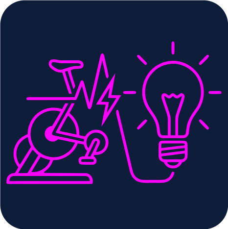

#  &nbsp; WattVibe 

# Setup
1. Installation: From the project root run
    ```bash
    uv init
    ```
2. Configuration: In the project root create a `.env` file with the following variables:
    ```bash
    FTP = 300  # Your current Functional Threshold Power
    TRAINER_ADDRESS = "DD:FB:7B:77:1F:EF"  # Bluetooth-Adresse des Trainers
    HUB_IP = "192.168.x.x"  # Dirigera Hub IP
    HUB_TOKEN = "YOUR_TOKEN"  # Dirigera Hub Token (see next section)
    LIGHT_NAME = "Trainer"  # Name of the Light to be controlled (set in IKEA Home App)
    # WEB_PORT = 5001  # Port for the status page (optional)
    ```
3. Start WattVibe:
    ```bash
    uv run start-app
    ```
    (you can also run in mock mode for testing by adding the flag `--mock`)
4. Check the current status under [http://localhost:<WEB_PORT>](http://localhost:5001)

### Dirigera Setup

1. Find your Dirigera's IP address (check your router's device list)
2. Run the generate-token script with your hub's IP address:
    ```bash
    uv run generate-token <your-dirigera-ip-address>
    ```
3. Press the action button on the bottom of your Dirigera hub when prompted
4. Press ENTER and the token will be printed to your console
5. set `HUB_TOKEN` in your `.env` file
